# Aether Runtime

**Compile once. Run on any hardware, forever.**

Aether is an open-source AI model compiler and inference runtime. It ingests any open-source model (HuggingFace, GGUF, SafeTensors, ONNX) and produces a portable **Aether Execution Graph (AEG)** artifact that runs on any detected hardware — CPU, GPU, NPU, FPGA — with zero framework dependency and zero re-compilation.

[](LICENSE)
[](pyproject.toml)

---

## Benchmark Results — Aether vs HuggingFace Transformers

> Measured on **2x Tesla T4 (14.6 GiB each)** · BF16 · Kaggle · Aether Runtime v1.2.8 · Transformers v5.0.0
> Full report: [`benchmark/results/BENCHMARK_RESULTS.md`](benchmark/results/BENCHMARK_RESULTS.md)

### Mean Speedup per Model

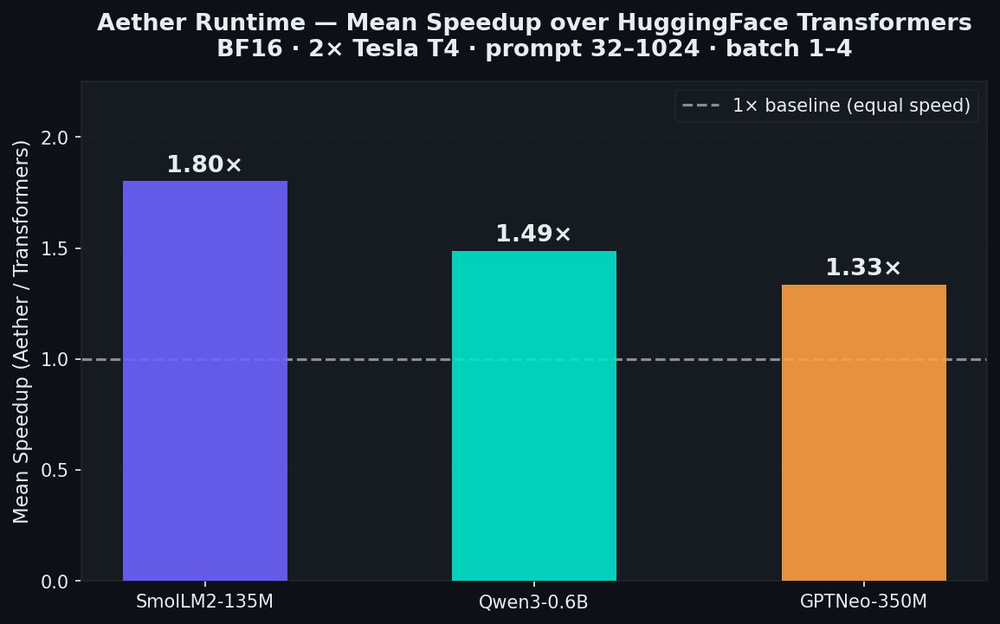

| Model | Best Speedup | Mean Speedup | Worst Cell |
|-------|-------------|--------------|-----------|
| SmolLM2-135M-Instruct | **1.93x** (P256/B1) | **1.80x** | 1.56x (P1024/B4) |
| Qwen3-0.6B | **2.14x** (P32/B1) | **1.57x** | 1.16x (P1024/B4) |
| GPTNeo350M-Instruct-SFT | **1.83x** (P32/B1) | **1.37x** | 0.93x (P1024/B4) |

> **26 of 27 cells**: Aether faster by >5% &nbsp;|&nbsp; **1 cell**: Transformers faster (GPTNeo P1024/B4, full-MHA KV pressure)

---

### SmolLM2-135M-Instruct

#### Throughput (tok/s) — Bar Chart

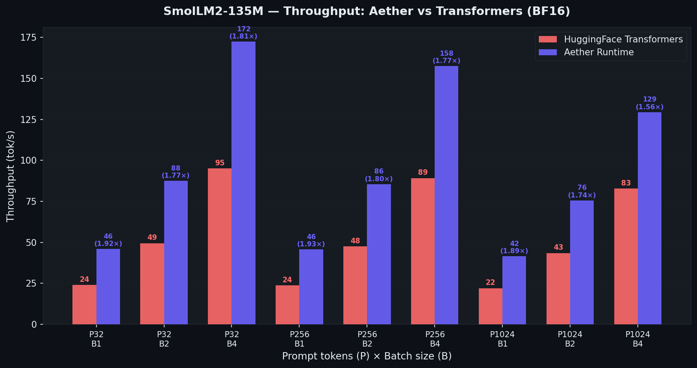

#### Throughput vs Prompt Length — Line Chart

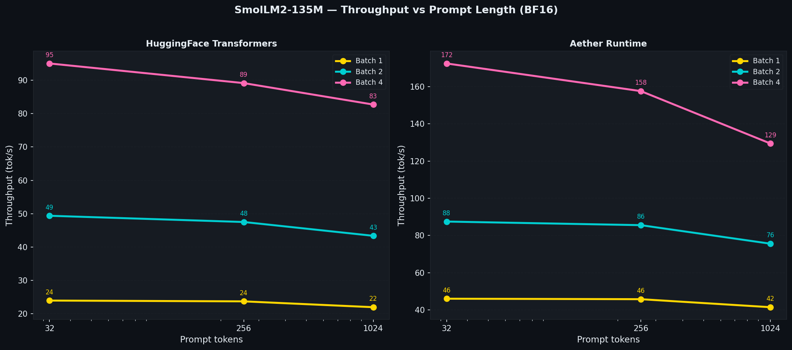

#### Speedup Heatmap (Aether / Transformers)

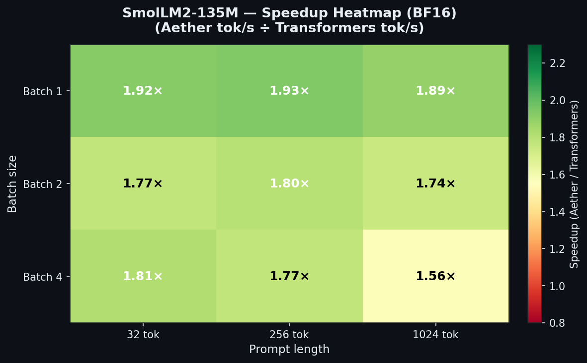

#### Latency (s) — Bar Chart

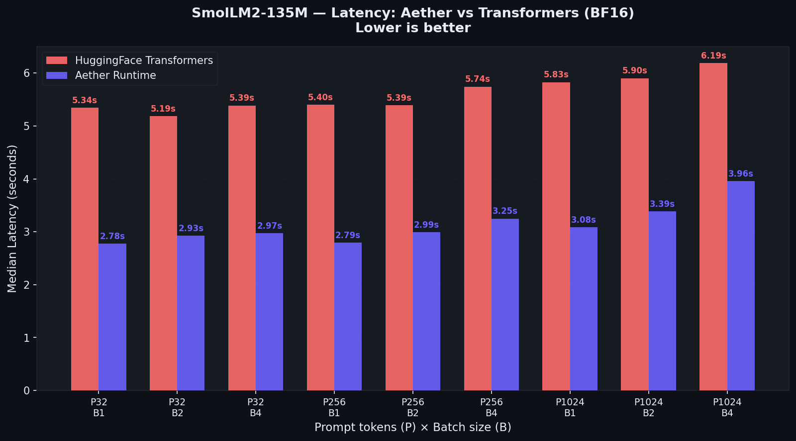

#### Throughput Table

| Prompt | Batch | Aether tok/s | HF tok/s | Speedup |
|--------|-------|-------------|---------|---------|
| 32 | 1 | **46.06** | 23.95 | 1.92x |
| 32 | 2 | **87.50** | 49.37 | 1.77x |
| 32 | 4 | **172.41** | 95.03 | 1.81x |
| 256 | 1 | **45.80** | 23.71 | 1.93x |
| 256 | 2 | **85.56** | 47.50 | 1.80x |
| 256 | 4 | **157.56** | 89.14 | 1.77x |
| 1024 | 1 | **41.50** | 21.96 | 1.89x |
| 1024 | 2 | **75.61** | 43.36 | 1.74x |
| 1024 | 4 | **129.43** | 82.71 | 1.56x |

---

### Qwen3-0.6B

#### Throughput (tok/s) — Bar Chart

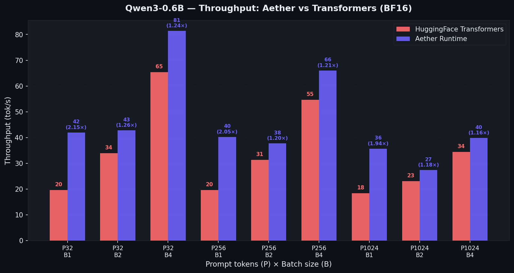

#### Throughput vs Prompt Length — Line Chart

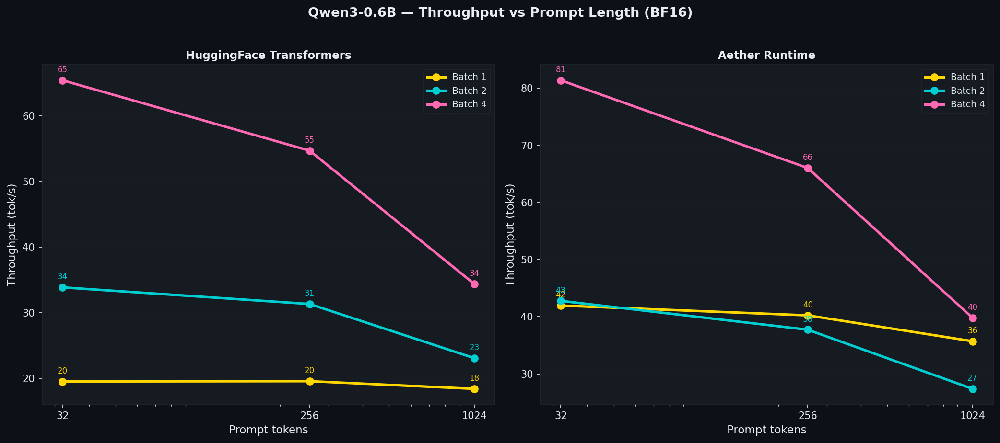

#### Speedup Heatmap (Aether / Transformers)

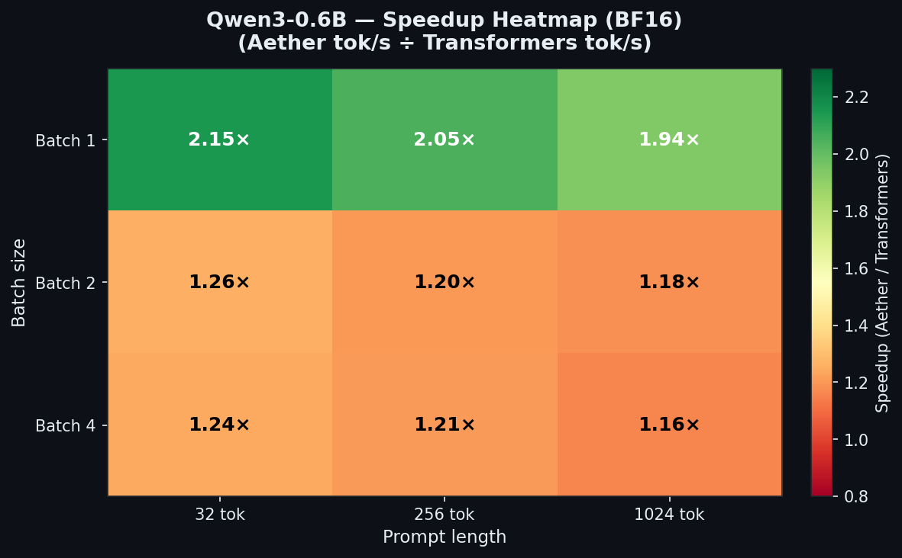

#### Latency (s) — Bar Chart

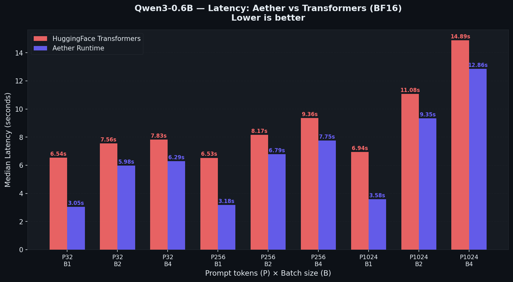

#### Throughput Table

| Prompt | Batch | Aether tok/s | HF tok/s | Speedup |
|--------|-------|-------------|---------|---------|
| 32 | 1 | **41.96** | 19.56 | 2.14x |
| 32 | 2 | **42.78** | 33.88 | 1.26x |
| 32 | 4 | **81.40** | 65.40 | 1.24x |
| 256 | 1 | **40.24** | 19.60 | 2.05x |
| 256 | 2 | **37.73** | 31.35 | 1.20x |
| 256 | 4 | **66.04** | 54.69 | 1.21x |
| 1024 | 1 | **35.71** | 18.44 | 1.94x |
| 1024 | 2 | **27.38** | 23.11 | 1.18x |
| 1024 | 4 | **39.81** | 34.39 | 1.16x |

---

### GPTNeo350M-Instruct-SFT

#### Throughput (tok/s) — Bar Chart

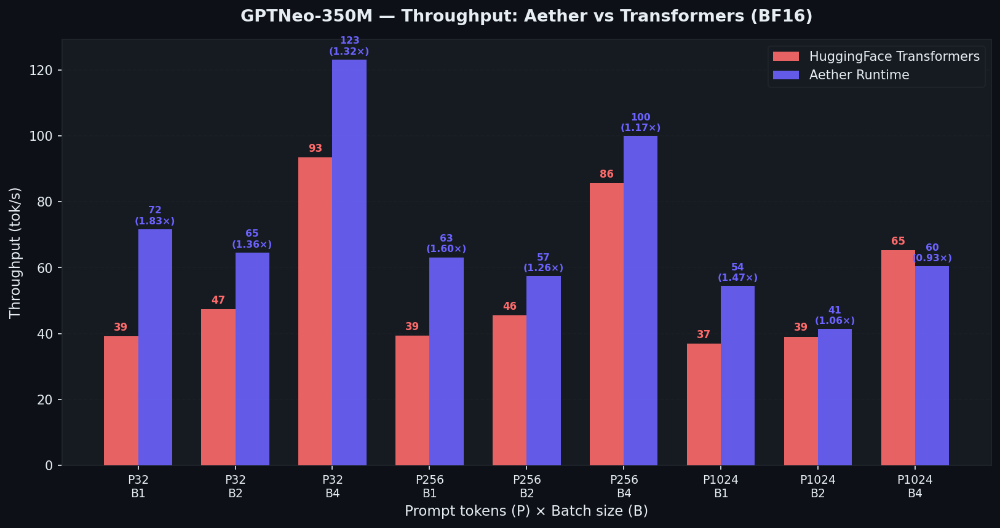

#### Throughput vs Prompt Length — Line Chart

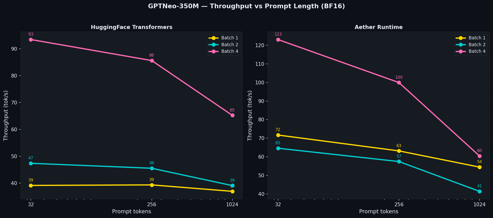

#### Speedup Heatmap (Aether / Transformers)

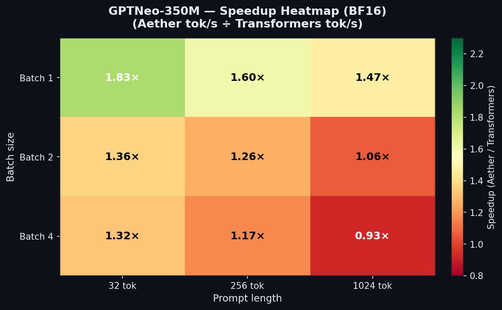

#### Latency (s) — Bar Chart

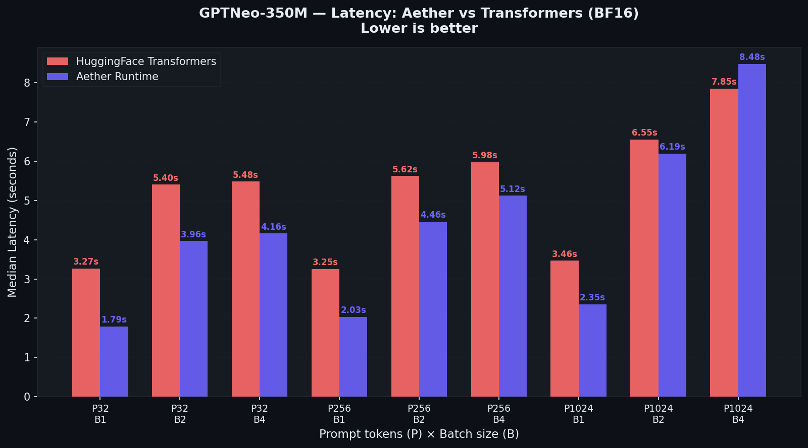

#### Throughput Table

| Prompt | Batch | Aether tok/s | HF tok/s | Speedup |
|--------|-------|-------------|---------|---------|
| 32 | 1 | **71.67** | 39.14 | 1.83x |
| 32 | 2 | **64.57** | 47.37 | 1.36x |
| 32 | 4 | **123.11** | 93.42 | 1.32x |
| 256 | 1 | **63.14** | 39.34 | 1.61x |
| 256 | 2 | **57.40** | 45.53 | 1.26x |
| 256 | 4 | **99.94** | 85.60 | 1.17x |
| 1024 | 1 | **54.41** | 36.94 | 1.47x |
| 1024 | 2 | **41.35** | 39.08 | 1.06x |
| 1024 | 4 | 60.38 | **65.21** | 0.93x |

> **Note (P1024/B4):** Only cell where Transformers wins. Full MHA (no GQA) causes KV-cache memory spill at large batch x long context. Targeted for v1.3.

---

## Core Principles

| Principle | Implementation |
|-----------|---------------|
| **Compile once, run anywhere** | AEG artifacts are hardware-portable; they contain multi-target sharding plans and run without re-compilation |
| **PyTorch-free core** | The runtime, compiler, and CPU engine require only NumPy + tokenizers. PyTorch is optional (`pip install "aether-runtime[pytorch]"`) |
| **Universal hardware detection** | Detects NVIDIA (CUDA), AMD (ROCm), Apple (Metal/MPS), Intel (OpenVINO), Qualcomm (QNN), RISC-V, FPGA, and pure CPU — no driver installation required |
| **Multi-GPU with VRAM-weighted distribution** | Automatically shards model weights across all available GPUs proportional to each GPU's VRAM capacity |
| **Framework-free native kernels** | C++ kernels compiled at runtime: INT4-GEMV, FlashAttention-2, fused RMSNorm+SwiGLU+Linear, GeGLU, RoPE, OpenMP parallel SGEMM |

---

## 5-Stage Compiler Pipeline

```
Model (HuggingFace / GGUF / SafeTensors / ONNX)
        │
        ▼
┌─────────────────────────────────────────────────────────────────┐
│ Stage 1: Ingestion & Architecture Detection                     │
│  • Reads config.json / GGUF header / SafeTensors metadata       │
│  • Detects 60+ model families without relying on model names    │
│  • Outputs: AEG-IR computation graph + ModelArchitecture        │
└─────────────────────────────────────────────────────────────────┘
        │
        ▼
┌─────────────────────────────────────────────────────────────────┐
│ Stage 2: Optimizer (22 Passes)                                  │
│  Pass 1: Operator Fusion (RMSNorm→QKV→RoPE, SwiGLU fusion)     │
│  Pass 2: Sensitivity Analysis (per-layer perplexity gradient)   │
│  Pass 3: Precision Assignment (mixed-precision per sensitivity) │
│  Pass 4: KV Cache Structuring (paged blocks, radix-tree hints)  │
│  Pass 5: MoE Expert Routing (hot/warm/cold tier classification) │
│  Pass 6: Parallelism Discovery (TP/PP/EP/CP strategy search)   │
│  Pass 7–22: Graph lowering, sparse attention, pruning, etc.     │
└─────────────────────────────────────────────────────────────────┘
        │
        ▼
┌─────────────────────────────────────────────────────────────────┐
│ Stage 3: Quantization                                           │
│  • Q4_K_M (INT4 block-scaled) — default for ≤70B models        │
│  • Q8_0 (INT8 symmetric)                                        │
│  • BF16 / FP16 / FP8 (E4M3 / E5M2)                            │
│  • MXFP4 / MXFP6 (microscaling, PRD v4.0+)                     │
└─────────────────────────────────────────────────────────────────┘
        │
        ▼
┌─────────────────────────────────────────────────────────────────┐
│ Stage 4: AEG Packaging                                          │
│  • Self-contained .aeg/ directory with manifest, weights,       │
│    tokenizer, precision map, sharding plans                     │
│  • Integrity-verified (SHA-256 per artifact)                    │
│  • Version-stamped (AEG/1.1 – AEG/3.0)                        │
└─────────────────────────────────────────────────────────────────┘
        │
        ▼
┌─────────────────────────────────────────────────────────────────┐
│ Stage 5: Target Code Generation                                 │
│  • CUDA (sm70–sm130), ROCm (RDNA3, CDNA3/4/5)                 │
│  • Apple Metal (M1–M5), OpenVINO (NPU/GPU)                     │
│  • Qualcomm QNN, RISC-V NPU, FPGA                              │
│  • Native CPU (AVX-512, AVX2, NEON, ternary BitNet)            │
└─────────────────────────────────────────────────────────────────┘
        │
        ▼
  AEG artifact (.aeg/) — runs anywhere, forever
```

---

## Quick Start

```bash
pip install aether-runtime

# Compile a model to AEG
aether compile meta-llama/Llama-3.1-8B --target cuda_sm90 --precision q4_k_m

# Inspect the compiled artifact
aether inspect llama-3.1-8b.aeg/

# Run inference (no GPU required for CPU target)
aether serve llama-3.1-8b.aeg/ --port 8080

# Benchmark performance
aether bench llama-3.1-8b.aeg/

# Run evaluation gate
aether eval llama-3.1-8b.aeg/ --suite reasoning --max-regression 0.02
```

### Python API

```python
from aether.compiler import AetherCompiler
from aether.compiler.config import CompilerConfig

# Compile — no PyTorch required
compiler = AetherCompiler()
config = CompilerConfig(
    target="cuda_sm90",
    precision="q4_k_m",
    max_context_length=131072,
)
artifact = compiler.compile("meta-llama/Llama-3.1-8B", config)
print(artifact.summary())   # model_id, target, precision, size_gb, tok/s estimate

# Run compiled AEG
from aether.backends import get_backend

backend = get_backend("aether_cpu")   # or "vllm", "mlx", "onnxruntime"
backend.load_model("llama-3.1-8b", aeg_path="llama-3.1-8b.aeg/")
result = backend.generate(GenerationRequest(
    model_id="llama-3.1-8b",
    prompt="What is quantum entanglement?",
    max_tokens=512,
))
print(result.text)
print(f"Throughput: {result.metrics['throughput_tps']:.1f} tok/s")
```

---

## Multi-GPU Execution (VRAM-Weighted Tensor Parallel)

When multiple GPUs are present, Aether automatically distributes the model across all of them using **VRAM-weighted capacity partitioning**. Each GPU holds a fraction of every projection layer proportional to its available VRAM — not a simple equal split.

```python
from aether.parallelism.planner import ParallelismPlanner
from aether.parallelism.sharding import DeviceCapacity

# VRAM-weighted heterogeneous sharding plan
planner = ParallelismPlanner(architecture)
plan = planner.plan_for_devices([
    DeviceCapacity(device_id="cuda:0", compute_units=1.0, memory_bytes=24 * 1024**3),  # 24 GB
    DeviceCapacity(device_id="cuda:1", compute_units=0.5, memory_bytes=12 * 1024**3),  # 12 GB
])
# cuda:0 holds ~67% of weights, cuda:1 holds ~33%
print(plan.weight_fractions)   # {"cuda:0": 0.667, "cuda:1": 0.333}
```

The compiler embeds sharding plans for 1–8 GPUs in every AEG artifact (Pass 6: Parallelism Discovery). At runtime the distributed engine reads the matching plan and reduces with Aether's own collectives.

**Which collective runs where — precisely.** "No NCCL" is true of two of the three paths, and the difference matters:

| Execution mode | Collective | NCCL / `torch.distributed`? |
|----------------|-----------|------------------------------|
| CPU, multi-process | `SocketCollective` — ring reduce-scatter + all-gather over TCP | **Not required.** Verified across real processes up to 8 ranks. |
| Single-process, multi-GPU | `aether.parallelism.p2p_ring` — one-shot / two-shot / ring over CUDA-ROCm peer-to-peer device copies | **Not required.** This is the path the tensor-parallel executor uses. |
| Multi-process or multi-node GPU | NCCL (CUDA) or RCCL (ROCm) via `torch.distributed` | **Required.** Aether does not reimplement inter-node GPU transport, and asking for this backend on a host without it fails closed. |

The peer-to-peer path picks its schedule per call from the α–β cost model, using the
detected link latency and bandwidth — because no single schedule is right at both
ends of the size range:

```
one-shot   α + (P−1)·D/B            volume (P−1)·D        — small payloads, latency-bound
two-shot   2α + 2(P−1)/P·D/B        volume 2(P−1)/P·D     — large payloads, fully peer-connected
ring       2(P−1)·α + 2(P−1)/P·D/B  volume 2(P−1)/P·D     — meshes without full peer access
```

Crossover, from setting the first two equal: `D* = α·P·B / ((P−1)(P−2))` for `P > 2`.
At `P = 2` one-shot is never worse — same volume, half the hops.

Every collective fails closed. A ring that loses a peer raises `CollectiveError`
rather than returning an approximation. Reductions run in a fixed device order, so
results are bit-reproducible and every device gets identical bytes.

```python
from aether.parallelism.p2p_ring import P2PRingCollective

collective = P2PRingCollective(["cuda:0", "cuda:1", "cuda:2", "cuda:3"])
reduced = collective.all_reduce(per_device_partials)   # every device: the full sum
root    = collective.reduce_to_root(per_device_partials)  # tree, ceil(log2 P) rounds
print(collective.stats()["requires_nccl"])            # False
```

References: Patarasuk & Yuan, *JPDC* 69(2), 2009 (ring bandwidth bound); Thakur,
Rabenseifner & Gropp, *IJHPCA* 19(1), 2005 (algorithm choice by message size);
Shoeybi et al., arXiv:1909.08053 §3.3 (why this all-reduce dominates TP cost).

---

## Hardware Detection

```python
from aether.backends.hardware_detector import detect_hardware

profile = detect_hardware()
print(profile.summary())
# ┌─────────────────────────────────────────────────────┐
# │ Aether Hardware Profile                             │
# │  GPUs:  2x NVIDIA RTX 4090 (24 GB each) → cuda_sm89│
# │  CPU:   AMD Ryzen 9 7950X  (AVX-512)   → cpu_avx512│
# │  RAM:   128 GB                                      │
# │  Best target: cuda_sm89                             │
# └─────────────────────────────────────────────────────┘
```

Detected targets span: NVIDIA CUDA (sm70–sm130), AMD ROCm (RDNA3, CDNA3/4/5), Apple Metal (M1–M5), Intel OpenVINO (NPU/GPU), Qualcomm QNN, RISC-V NPUs (SiFive X160, XuanTie C930, MIPS S8200), Xilinx FPGA, and CPU (AVX-512, AVX2, NEON, ternary).

---

## Native CPU Kernel Stack

The Aether CPU engine compiles a C++ shared library at first run (cached thereafter) providing the following kernels — all OpenMP-parallel and auto-vectorized to AVX-512/NEON:

| Kernel | Description | Research Basis |
|--------|-------------|----------------|
| `aether_int4_gemv` | **INT4-packed GEMV** — 2x bandwidth vs INT8, ~2x tok/s | GGML Q4_0 (2023), GPTQ (2022) |
| `aether_qgemv_affine` | INT8 affine-quantized GEMV | Frantar et al. 2022 |
| `aether_flash_attn` | FlashAttention-2 online softmax (O(seq·d) memory) | Dao, NeurIPS 2023 |
| `aether_rmsnorm_linear` | Fused RMSNorm + QKV projection (1 buffer) | ClusterFusion NeurIPS 2025 |
| `aether_rmsnorm_swiglu_linear` | Fused RMSNorm + full SwiGLU FFN (0 intermediate buffers) | Shazeer 2020, ClusterFusion 2025 |
| `aether_geglu` | GeGLU for Gemma/Gemma-2 FFN | Hendrycks 2016, Google Gemma 2024 |
| `aether_swiglu` | SwiGLU activation (Llama/Qwen/Mistral) | Shazeer 2020 |
| `aether_rope` | Rotary position embedding in-place | Su et al. 2021 |
| `aether_sgemv` | FP32 GEMV (M=1 decode fast path, ~3x vs SGEMM) | BLIS (Van Zee 2015) |
| `aether_sgemm` | Cache-blocked FP32 SGEMM (prefill) | BLIS tile layout |
| `aether_softmax` | Numerically stable row-wise softmax | Standard |
| `aether_rmsnorm` | Double-accumulation RMSNorm | Zhang & Sennrich 2019 |
| `aether_argmax` | Greedy token selection (OpenMP reduction) | Standard |

No compiler toolchain? Every kernel has a NumPy fallback — the module always imports and runs.

---

## Supported Model Families

Aether classifies **40 architecture families**, reached through **164** model-name
and Hugging Face architecture-class spellings. Support is graded, because "it
runs" and "its logits match the reference" are different claims:

| Level | Families | Meaning |
|-------|---------:|---------|
| ✅ Parity-verified | **26** | Every logit compared against the 🤗 Transformers reference (~1e-6) on the CPU, PyTorch, and tensor-parallel engines, for prefill and decode |
| 🟡 Runs, not gated | **6** | Compile → load → execute round-trip tested; no automatic per-logit comparison yet (5 encoders + T5/BART-class seq2seq) |
| 🔬 Known-incorrect | **4** | Executes, but measured output diverges from the reference — documented, not relied upon (Mamba, Mamba-2, RWKV-7, Jamba) |
| ❌ Refused | **4** | Detected and then rejected at compile time rather than producing a wrong artifact (DeepSeek MLA, MiniMax, VLM, Whisper) |

**36 families are executable; 26 are verified.** The exact numbers come from
[`src/aether/core/model_families.py`](src/aether/core/model_families.py) and are
asserted against this table by `tests/unit/test_model_family_registry.py`, so
they cannot drift. Print them yourself:

```bash
aether models              # the full graded matrix
aether models --counts     # just the numbers
```

A fine-tune of a verified family is covered by that family — detection keys on
structure, not on name — which is why Vicuna, Zephyr, Dolphin, Tulu,
Nous-Hermes, OpenChat, TinyLlama, Yi, InternLM, MiniCPM, SOLAR and the rest of
the Llama/Qwen/Mistral derivative space add detection keys rather than families.
See [SUPPORTED_MODELS.md](SUPPORTED_MODELS.md) for the per-family matrix with the
distinguishing numerics Aether derives from each checkpoint.

### The 26 parity-verified families

| Family | Models | Distinguishing contract |
|--------|--------|-------------------------|
| Llama 3.x | Llama-3.1-8B, 3.2-1B/3B, 3.3-70B | GQA + SwiGLU + RMSNorm + RoPE (baseline) |
| Qwen 2 / 2.5 | Qwen2-7B/72B, Qwen2.5, CodeQwen | GQA + SwiGLU, schedule-gated sliding window |
| Qwen 3 | Qwen3-0.6B → 72B | per-head Q/K-norm, decoupled `head_dim` |
| Qwen 3 MoE | Qwen3-MoE | experts **without** top-k renormalization |
| Mistral | Mistral-7B v0.1–v0.3, Ministral | GQA + SwiGLU |
| Mixtral | Mixtral-8x7B/8x22B | top-2 of 8 experts **with** renormalization |
| Gemma 2 | Gemma-2-2B/9B/27B | ×√H embeddings, (1+w) norms, sandwich norm, logit soft-caps, GeGLU |
| Gemma 3 (text) | Gemma-3-1B/4B/12B/27B | Gemma 2 + separate local rotary base |
| GPT-2 | GPT-2 117M–1.5B, DialoGPT | Conv1D layout, GELU-tanh, learned positions |
| GPT-Neo | GPT-Neo 125M/1.3B/2.7B | **unscaled attention**, local/global schedule |
| GPT-NeoX | GPT-NeoX-20B, Pythia 70M–12B | 25% partial rotary, head-interleaved QKV, parallel residual |
| GPT-J | GPT-J-6B | interleaved rotary, parallel residual |
| Phi-3 / Phi-4 | Phi-3-mini/small/medium, Phi-4 | fused QKV, LongRoPE factor tables |
| Falcon | Falcon-7B/40B | per-KV-group interleaved QKV, parallel residual |
| BLOOM | BLOOM 560M–176B, BLOOMZ | **ALiBi**, embedding LayerNorm |
| MPT | MPT-7B/30B | ALiBi, nested `attn_config` spellings |
| StarCoder2 | StarCoder2-3B/7B/15B | GQA, GELU-tanh, `layer_types` window |
| Cohere / Command-R | Command-R/R+/A, Aya Expanse | interleaved rotary, `logit_scale` |
| OLMo 2 | OLMo-2-7B/13B | **post-norm** block, full-projection Q/K-norm |
| OLMoE | OLMoE-1B-7B | full-projection Q/K-norm, unnormalized experts |
| StableLM | StableLM-2, StableLM-3B | 25% partial rotary |
| Granite | Granite-3.x, Granite Code | embedding/residual/attention/logit multipliers |
| EXAONE 4 | EXAONE-4-32B | post-norm, **NoPE global layers** |
| SmolLM 3 | SmolLM3-3B | interleaved NoPE layers |
| GLM-4 | GLM-4-9B/32B | interleaved + 50% partial rotary, GLM sandwich norm |
| Nemotron | Nemotron-4, Nemotron-Mini | `LayerNorm1P`, squared-ReLU FFN |

---

## Supported Hardware Targets

| Target ID | Hardware |
|-----------|----------|
| `cuda_sm89` | NVIDIA RTX 4090 (Ada Lovelace) |
| `cuda_sm90` | NVIDIA H100 (Hopper) |
| `cuda_sm100` | NVIDIA B200 (Blackwell) |
| `cuda_sm130` | NVIDIA Rubin Ultra (sm_130) |
| `rocm_cdna3` | AMD MI300X |
| `rocm_cdna5_mi455x` | AMD MI455X (CDNA5) |
| `metal_m3` | Apple M3/M4/M5 |
| `openvino_npu` | Intel Arc NPU |
| `qualcomm_qnn` | Qualcomm Snapdragon NPU |
| `cpu_avx512` | x86-64 with AVX-512 |
| `cpu_neon` | ARM NEON (mobile, Raspberry Pi) |
| `cpu_avx512_ternary` | BitNet b1.58 ternary on x86 |
| `riscv_sifive_x160` | SiFive Intelligence X160 |
| `fpga_xilinx_vu9p` | Xilinx VU9P (decode-only) |

Full list: 30+ targets in [`src/aether/core/constants.py`](src/aether/core/constants.py).

---

## Phase 5 — Observability

Aether emits **OTLP directly** — the wire protocol, not a JSON file that resembles
it. `trace_id`/`span_id` widths, typed `AnyValue` attributes (`intValue` as a
string, per the protobuf JSON mapping), `timeUnixNano` events, per-span `kind`,
real gzip when `Content-Encoding: gzip` is advertised, W3C `traceparent`
propagation, trace-ID-ratio sampling, and the standard `OTEL_*` environment
variables. No dependency is needed for any of it; conformance is pinned by
[`tests/unit/test_otlp_conformance.py`](tests/unit/test_otlp_conformance.py).

```python
from aether.observability.otel import AetherTracer, OTLPExporter, MetricsCollector

tracer = AetherTracer(service_name="aether-prod", sample_rate=0.01)
exporter = OTLPExporter()          # honours OTEL_EXPORTER_OTLP_ENDPOINT/HEADERS/TIMEOUT
exporter.export_to_endpoint(tracer)

metrics = MetricsCollector()
exporter.export_metrics_to_endpoint(metrics)   # real explicit-bucket histograms
```

Joining a trace that started upstream, and a span that records its own failure:

```python
with tracer.span("aether.prefill", traceparent=request.headers.get("traceparent")) as span:
    span.add_event("kv_built", {"blocks": 128})
```

**Routing through an existing OpenTelemetry SDK pipeline** — span processors,
resource detectors, propagators, exporters configured by the host application —
is the one thing that needs the dependency:

```bash
pip install "aether-runtime[otel]"
```

```python
from aether.observability.otel_sdk import OpenTelemetryBridge, is_available

if is_available():
    OpenTelemetryBridge("aether-prod").emit_all(tracer.get_finished_spans())
    # spans keep Aether's trace_id, so they correlate rather than duplicating
```

```python
from aether.observability.ci_pipeline import CIEvalPipeline
from aether.observability.gates import DriftMonitor, ABRolloutController

pipeline = CIEvalPipeline(aeg_path='model.aeg', max_regression=0.02)
report = pipeline.run_and_save('eval_report.json', benchmarks=['hellaswag', 'mmlu', 'gsm8k'])

ctrl = ABRolloutController('exp-001', candidate_percent=0.01)
monitor = DriftMonitor(baseline_win_rate=0.80, alert_drop=0.05, min_samples=20)
```

**Prometheus metrics:** `aether_request_total`, `aether_ttft_ms{quantile=p50|p95|p99}`, `aether_tokens_per_second`, `aether_kv_hit_rate`, `aether_eagle_accept_rate`

---

## Content Credentials (C2PA)

`aether sign` writes a real [C2PA](https://c2pa.org) manifest store to
`provenance/c2pa.manifest` inside the package — not a hash chain with C2PA-shaped
field names:

* a **`c2pa.claim.v2` claim** in deterministic CBOR (RFC 8949 §4.2.1), referencing
  every assertion by hashed URI;
* an **assertion store** with the hard binding, `c2pa.actions.v2`,
  `c2pa.ingredient.v3` for the source checkpoint, and the compiler-pass chain;
* a **`COSE_Sign1` claim signature** (RFC 9052), detached, with the signer's X.509
  chain in the `x5chain` protected header;
* the tree serialized as **JUMBF** boxes (ISO/IEC 19566-5);
* a **`c2pa.hash.collection.data` hard binding** — one digest per file, so
  verification reports *which* file changed.

Ed25519 (RFC 8032), CBOR, COSE and JUMBF are implemented in pure Python, so signing
works on a stock CPython install; `cryptography` is used when present for speed and
for the ECDSA algorithms.

```bash
aether sign   ./model.aeg                      # generates a key on first use
aether verify ./model.aeg                      # exits non-zero if integrity fails
aether verify ./model.aeg --trust-anchor ca.pem
```

Verification reports five checks independently — manifest present, structure,
claim signature, assertion hashes, file binding — because the failures mean
different things. **Integrity is not identity:** a self-signed manifest proves the
artifact is unmodified and says nothing about who produced it, and `aether verify`
states that rather than printing "verified".

---

## Phase 6 — Ecosystem

```python
from aether.ecosystem.sdks import TypeScriptSDKGenerator, GoSDKGenerator, RustSDKGenerator

TypeScriptSDKGenerator().write('./sdk/typescript/')   # aether-sdk.ts
GoSDKGenerator().write('./sdk/go/')                   # aether_client.go
RustSDKGenerator().write('./sdk/rust/src/')           # aether_client.rs
```

---

## CLI Reference

| Command | Description |
|---------|-------------|
| `aether compile <model>` | Compile model to AEG package |
| `aether inspect <path.aeg>` | Show AEG package summary |
| `aether bench <path.aeg>` | Run benchmark suite |
| `aether serve <path.aeg>` | Start inference server |
| `aether eval <path.aeg>` | Run eval gate CI check |
| `aether hardware` | Show hardware profile |
| `aether models` | Show the graded model-family support matrix |
| `aether hub push <path.aeg>` | Push to Aether Hub CDN |
| `aether hub pull <model-id>` | Pull from Aether Hub CDN |
| `aether sdk generate` | Generate TypeScript/Go/Rust SDKs |
| `aether sign <path.aeg>` | Sign with C2PA Content Credentials (CBOR claim + COSE_Sign1 + JUMBF) |
| `aether verify <path.aeg>` | Verify the claim signature, assertion hashes, and per-file binding |

---

## Installation

```bash
# Core runtime (no PyTorch, no CUDA required)
pip install aether-runtime

# With PyTorch for .pt/.pth model ingestion
pip install "aether-runtime[pytorch]"

# With HuggingFace Transformers for AutoTokenizer, AutoConfig
pip install "aether-runtime[transformers-frontend]"

# Full install (all optional backends)
pip install "aether-runtime[full]"
```

---

## Testing

```bash
python -m pytest tests/ -v                                     # All tests
python -m pytest tests/unit/test_native_cpu_kernels.py -v     # CPU kernels
python -m pytest tests/unit/test_phase5_observability.py -v   # Observability
python -m pytest tests/unit/test_phase6_ecosystem.py -v       # Ecosystem SDKs
python -m pytest tests/unit/test_v31_elite_extensions.py -v   # v3.1 extensions
```

> **Run the suite serially.** `test_e2e_compile_run_cpu.py` and `test_v31_features.py` share the `~/.aether` cache; parallel pytest workers race on it.
>
> Tests requiring HuggingFace weights skip cleanly when offline.

---

## Research Citations

| Feature | Research |
|---------|----------|
| INT4 GEMV | Gerganov GGML Q4_0 (2023), Frantar GPTQ (2022) |
| FlashAttention-2 | Dao et al., NeurIPS 2023 |
| Operator Fusion | ClusterFusion, NeurIPS 2025 |
| SwiGLU / GeGLU | Shazeer 2020 (GLU Variants); Hendrycks & Gimpel 2016 |
| BLIS SGEMM tiles | Van Zee & van de Geijn, TOMS 2015 |
| VRAM-weighted TP | Megatron-LM (Shoeybi et al. 2019); DeepSpeed (Rasley et al. 2020) |
| MoE Expert Routing | Zipf prior: Zoph et al. 2022; Fedus et al. 2022 |
| Sparse Attention | MInference (Microsoft, NeurIPS 2024) |
| KV Eviction | StreamingLLM (2023), ScissorHands (2024), SnapKV (2025) |
| Ring Attention | Ring Attention (2023), Striped Attention (2023) |
| YaRN RoPE | YaRN (2023), LongRoPE (2024) |
| Speculative Decoding | EAGLE-2 (2024), Medusa (2024) |
| CUDA Graphs | vLLM CUDA Graphs Dispatcher (2026) |
| Process Reward Model | Let's Verify Step by Step (2023), OmegaPRM (2025) |
| IP Fingerprinting | MetaFinger (2024), ADV-TRA (2025) |
| EU AI Act Compliance | Article 50 — AI content transparency obligations |
| Fleet Scheduling | Helium (2026), MuxWise SLO-aware scheduling (2026) |
| Disaggregated Serving | DistServe (2024), Mooncake (2024) |

---

## License

Apache 2.0

*Aether Runtime — Compile once. Run on any hardware, forever.*
